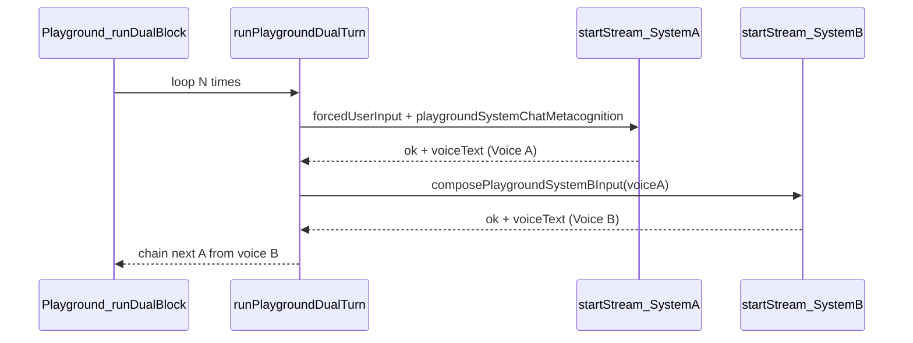

# Fix System Chat stopping after Voice + From A's last Voice button

## How turns are supposed to work

- Orchestration: [`src/components/Playground.jsx`](f:\Alek\YourBrain\src\components\Playground.jsx) (`runDualBlock` / `runDualBlockFromB`) loops [`PLAYGROUND_DUAL_TURNS_PER_BLOCK`](f:\Alek\YourBrain\src\lib\playgroundDualGraphRunner.js) (5) times.
- Each A→B pair: [`runPlaygroundDualTurn`](f:\Alek\YourBrain\src\lib\playgroundDualGraphRunner.js) calls [`startConsciousnessStreamRun`](f:\Alek\YourBrain\src\lib\consciousnessStreamRunner.js) twice, with `waitUntilInteractiveGraphOrStreamIdle()` between them (lines 211–212).
- A leg **stops the chain** if:
  - `!r.ok` (includes **busy gate** at the very start of `startConsciousnessStreamRun`: `isInteractiveGraphOrStreamActive()` → immediate `{ ok: false }` per lines 249–251), or
  - `empty_voice` when trimmed `voiceText` is empty after [`resolvePipelineVoiceText`](f:\Alek\YourBrain\src\lib\pipelineVoiceGate.js) (playground lines 206–208 / 299–306).

Server-side, System Chat forces **inline supervisor handling** on leg 1 via `deferMetacognitionRerun: !playgroundSystemChatMetacognition` and `maxMetacognitionReruns: 1` (see [`consciousnessStreamRunner.js`](f:\Alek\YourBrain\src\lib\consciousnessStreamRunner.js) ~545–550, ~598–601). Metacognition reruns should continue as extra HTTP legs inside [`consumePipelineSseWithMetacognitionContinuations`](f:\Alek\YourBrain\src\lib\pipelineSse.js), not as “Voice pending” deferrals.

## Primary hypothesis: Voice resolution vs merged graph store

On `complete`, the stream handler already **merges** server `sharedMemory.moduleOutputs` with the live graph store using [`mergeModuleOutputsPreferLonger`](f:\Alek\YourBrain\src\lib\cognitiveModules.js) (comment notes shorter `complete` payloads after server compression). Final voice text for persistence and for **playground** is resolved **only** from `streamResult` + `streamResult.sharedMemory`, not from the merged UI map.

**Planned fix (minimal, localized)**

1. Extend [`resolvePipelineVoiceText`](f:\Alek\YourBrain\src\lib\pipelineVoiceGate.js) (or the single call site in `consciousnessStreamRunner`) to fall back to **normalized `graphPipelineStore.getState().moduleOutputs`** when the primary resolution is empty (after the `complete` handler has merged).
2. Optionally align `finalOutput` in the `complete` handler with the same fallback: `evt.voiceOutput || mergedMo.voice` (UI key) so the dashboard matches dialogue persistence.

Keep the change **narrow**: only fallback when top-level/`sharedMemory` resolution is empty; preserve existing behavior when they agree.

## Secondary hypothesis: busy gate when starting the next leg

[`startConsciousnessStreamRun`](f:\Alek\YourBrain\src\lib\consciousnessStreamRunner.js) returns `{ ok: false, voiceText: '' }` if [`isInteractiveGraphOrStreamActive()`](f:\Alek\YourBrain\src\lib\pipelineBusyGate.js) is true (line 249). `runPlaygroundDualTurn` already waits for idle between A and B; if a race or another UI path leaves `graphPipelineStore.isRunning` / `consciousnessStreamStore.isProcessing` true, B would fail with `failed_or_aborted`.

**If reproduction shows B failing with no toast about empty Voice**, add a short investigation step: log or breakpoint at line 249 when `playgroundSystemChatMetacognition` is true. Only if confirmed, consider a **scoped** exemption (e.g. allow chaining when `beginPlaygroundDualOrchestration` depth > 0) or an extra `waitUntilInteractiveGraphOrStreamIdle` retry—this should be a last resort because it weakens global backpressure.

## UI: "From A's last Voice" (System B target)

**Existing behavior (System A):** When `inputTarget === 'A'`, **From B’s last Voice** calls `runDualBlock(systemAText.trim(), { startWithPeerB: true })`. That path (in `runDualBlock`) loads the latest mirror Voice via `lastSystemBVoiceForPeer(dialogueTurns, mirrorVoiceB)`, uses it as the peer line for System A, and treats the composer as an optional **human thread seed** (`humanAnchorAb`).

**Requested behavior (System B):** Add a symmetric control when `inputTarget === 'B'`: **From A’s last Voice** — seed the B→A block using **System A’s latest primary / System Chat Voice** (in-panel row or persisted `playground-dual-a` assistant line), matching [`lastVoiceAForPeer`](f:\Alek\YourBrain\src\components\Playground.jsx) / `latestAssistantVoiceTextForGraphSession(ConversationMessage, PLAYGROUND_GRAPH_SESSION_A)`.

**Implementation outline**

1. **Extend [`runDualBlockFromB`](f:\Alek\YourBrain\src\components\Playground.jsx)** with an option `{ startWithPeerA?: boolean }` parallel to `runDualBlock` + `startWithPeerB`:
   - Call `loadPersistedPeerVoices()` and resolve `peerA = lastVoiceAForPeer(dialogueTurnsRef.current, primaryVoiceA).trim()`.
   - If `!peerA`, toast (mirror copy of “No Voice B yet”) and return.
   - Set `lineForB = peerA` for the first `runPlaygroundSystemBOnly` (same as passing Voice A as the peer line into B).
   - Treat **composer** (`firstLineForB` argument) as optional **human thread anchor** for chaining / `humanOpening`, not as `lineForB` when `startWithPeerA` — mirror the `humanAnchorAb` / `useChain` logic used in `runDualBlock` for `startWithPeerB` (ensure turn 0 uses chained framing for the A leg when appropriate; adjust `humanAnchorBa` / `useChainA` so `humanOpening` is the composer seed, not the full peer Voice text).
2. **Button** next to **Random topic → B** / **Run** row when `inputTarget === 'B'`:
   - Label: **From A’s last Voice** (aria-label clarifying peer = primary System Chat Voice A).
   - Disabled when `!lastVoiceAForPeer(dialogueTurns, persistedPeerVoices.primaryVoiceA).trim()` or busy.
   - `onClick`: `runDualBlockFromB(systemAText.trim(), { startWithPeerA: true })` (composer optional seed, same pattern as **From B’s last Voice**).
3. **Copy/help text:** Update the short paragraph under the composer for `inputTarget === 'B'` and the empty-state blurb if needed to mention the new button alongside Random topic.

**Files:** primarily [`src/components/Playground.jsx`](f:\Alek\YourBrain\src\components\Playground.jsx); no changes to [`playgroundDualGraphRunner.js`](f:\Alek\YourBrain\src\lib\playgroundDualGraphRunner.js) unless a shared helper is cleaner (optional extract of “peer seed” helpers).

## Verification

- Run System Chat **Run** with a small model: confirm **two** `/api/pipeline/stream` requests for one A→B pair when Metacognition requests a rerun (continuation legs), and that the second system’s request occurs after the first leg’s stores go idle.
- After the voice-resolution fix: with the same scenario that used to stop after Voice in the panel, confirm `runPlaygroundDualTurn` receives non-empty `voiceText` and the dual block advances to the next iteration.
- **From A’s last Voice:** With primary transcript containing a recent Voice A and mirror ready, switch to System B, click the button (composer empty or with a short seed), confirm first B turn uses A’s line as peer input and the block runs five B→A cycles like a normal B start.
