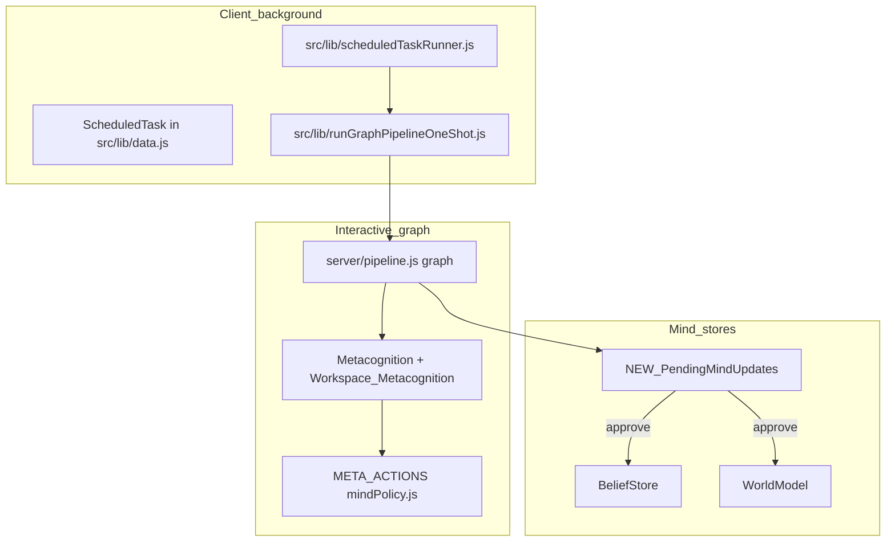

# Full autonomy upgrades and integrations

## Implementation status (keep this in sync)

| Area | Status | Notes |
|------|--------|--------|
| **PendingMindUpdate store + promotion** | Not implemented | No `PendingMindUpdate` / equivalent entity in [src/services/localStorage.js](src/services/localStorage.js) or [src/lib/data.js](src/lib/data.js) yet. |
| **Review inbox UI** | Not implemented | No dedicated inbox page; Belief Map unchanged for pending counts. |
| **META_ACTIONS expansion (scheduleTask, etc.)** | Not implemented | [server/mindPolicy.js](server/mindPolicy.js) `applyMetaActionsFromSupervisorText` still the original whitelist (`narrativeBrevity`, `scheduleTensionReview`, `suggestedPhase`, `beliefKeyDowngrades`). |
| **Autonomy budgets in runtime settings** | Not implemented | No `autonomy*` / `staging*` flags in [src/lib/runtimeSettings.js](src/lib/runtimeSettings.js) for this plan. |
| **Scheduler catch-up backoff + new task types** | Partially addressed elsewhere | [src/lib/scheduledTaskRunner.js](src/lib/scheduledTaskRunner.js) / [reloadInterruptedPipelineWork.js](src/lib/reloadInterruptedPipelineWork.js) exist; plan-specific types (`autonomous_consolidation`, `pending_inbox_digest`) and dedupe not added. |
| **External runner script / API** | Not implemented | — |
| **PROPOSED_REVISIONS / prompt contracts** | Not implemented | [shared/pipelineModules.mjs](shared/pipelineModules.mjs) has no separate propose-only JSON contract for beliefs/world beyond existing module text. |

### Related work already shipped (not the same project, but overlaps thematically)

These improve **global workspace visibility and merge discipline**; they do **not** replace the pending-inbox or staged Belief/World writes below.

| Feature | Where |
|--------|--------|
| `suppressedOrPeripheral` in Integration JSON, strict hay, fallback workspace | [server/pipeline.js](server/pipeline.js), [shared/pipelineModules.mjs](shared/pipelineModules.mjs), [server/mindPolicy.js](server/mindPolicy.js) |
| Cross-turn `workspaceDelta` | [server/workspaceDelta.js](server/workspaceDelta.js), mindPolicy `workspaceDeltaBlock`, SSE slim |
| Digest admission hints vs workspace stance | [server/contextMerge.js](server/contextMerge.js) `applyWorkspaceDigestAdmissionHints` |
| `globalWorkspaceFallback` badge + inspector | [src/components/graphPipeline/GraphPipelineInspector.jsx](src/components/graphPipeline/GraphPipelineInspector.jsx) |

---

## Layman terms — what you’re building

Today the app already has a structured “thinking pipeline” (modules, supervisors, reruns) and a **scheduler** that can run graph jobs in the background **while the app is open** (or pick them up when you come back). What you want next is three things working together:

1. **More freedom inside the graph** — The model can choose pacing and follow-ups more often (within budgets), instead of hitting hard “stop” gates unless something is really wrong or expensive.
2. **A “background mind”** — Work can be **queued** while you’re away. Because a normal website cannot reliably think with the tab fully closed, **true** background thinking means either processing that queue **when you next open the app**, or running a **small separate program** (or server job) that calls your API while the browser is off.
3. **Unsupervised but safe memory** — The system may **propose** new beliefs or world-model rows automatically, but they land in a **pending inbox** first: you can see what changed, why, and approve or reject before (or instead of) those ideas becoming “official.”

Nothing here removes your oversight; it adds **visibility and staging** so autonomy doesn’t silently rewrite what the mind “knows.”

---

## How this maps to the current codebase

**Anchors already in the repo**

- **Graph + supervisors + META_ACTIONS**: [`server/pipeline.js`](server/pipeline.js), [`server/mindPolicy.js`](server/mindPolicy.js) (`applyMetaActionsFromSupervisorText` ~2077+ handles `narrativeBrevity`, `scheduleTensionReview`, `suggestedPhase`, `beliefKeyDowngrades`).
- **Scheduled graph runs**: [`src/lib/scheduledTaskRunner.js`](src/lib/scheduledTaskRunner.js) (`runGraphPipelineForScheduler` → [`src/lib/runGraphPipelineOneShot.js`](src/lib/runGraphPipelineOneShot.js)); task persistence via [`src/lib/schedulerStore.js`](src/lib/schedulerStore.js) / `ScheduledTask`.
- **Due-task flush**: [`flushSchedulerDueTasksNow`](src/lib/scheduledTaskRunner.js) wired from places like [`src/lib/reloadInterruptedPipelineWork.js`](src/lib/reloadInterruptedPipelineWork.js), [`src/pages/ExtraPages.jsx`](src/pages/ExtraPages.jsx) (scheduler UI).
- **Belief/world persistence**: [`src/services/localStorage.js`](src/services/localStorage.js) entities `BeliefStore`, `WorldModel`; beliefs already use `status` (e.g. `active`, `contradicted`) in UI such as [`src/pages/BeliefMapPage.jsx`](src/pages/BeliefMapPage.jsx).
- **Post-pipeline persistence hub**: [`persistMindAfterPipeline`](src/lib/mindPersistence.js) (beliefs, `SELF_MODEL_DELTA` → world, tensions, etc.) — staging logic should branch here or immediately after [`persistGraphPipelineStreamResult`](src/lib/runGraphPipelineOneShot.js) when “propose-only” mode is on.

**Constraint (honest):** “App closed” for a web app usually means **no JS**. So the plan splits background into **(A) always feasible: queue + catch-up on next launch** and **(B) optional: external runner** for true off-line execution.

---

## Phase 1 — Staged writes + review inbox (foundation)

**Goal:** Any autonomous or background path writes **proposals** first; canonical stores update only via approve/merge (or strict auto-commit rules you define later).

1. **New store or entity** (e.g. `PendingMindUpdate` / `MindUpdateProposal`) in [`src/services/localStorage.js`](src/services/localStorage.js) + [`src/lib/data.js`](src/lib/data.js) exports, with fields such as: `kind` (belief|world), `payload`, `confidence`, `source` (`pipeline_run_id` / `scheduled_task_id`), `rationale`, `evidence_refs`, `created_at`, `status` (`pending` | `approved` | `rejected` | `superseded`).
2. **Server/client hook after pipeline completion** (where you already persist runs / notify storage): if module output or parsed JSON requests a write, **create pending rows** instead of direct `BeliefStore.create` / `WorldModel.create` for autonomous modes — or write with `status: pending_review` if you prefer extending existing rows (beliefs already have `status`; world rows may need the same pattern — verify schema usage in [`src/lib/mindPersistence.js`](src/lib/mindPersistence.js) and related apply paths).
3. **Review UI**: new page or section (e.g. under Dashboard / Scheduler / Belief map) listing pending items with **diff-style** statement text, **source run link**, batch approve/reject; optional filters by source (interactive vs scheduled).
4. **Promotion path**: on approve, apply the same logic as today’s BELIEF_REVISIONS / world-model updates (reuse existing helpers rather than duplicating business rules).

---

## Phase 2 — In-graph autonomy (policy + budgets)

**Goal:** More “do what it likes” **inside** the graph without silent store corruption.

1. **Budgets as settings/env**: caps for `maxMetacognitionReruns`, tokens, web fetches, and “autonomous META_ACTIONS” per run — surfaced in [`src/lib/runtimeSettings.js`](src/lib/runtimeSettings.js) / Local Mind UI patterns (similar to `strictGlobalWorkspaceBroadcast`).
2. **Expand META_ACTIONS contract** (whitelist only) in [`server/mindPolicy.js`](server/mindPolicy.js): e.g. `scheduleTask: { taskType, delayMinutes, reason }`, `requestBackgroundConsolidation`, `deferToNextSession` — each maps to **creating a `ScheduledTask`** or setting `followupHints`, never arbitrary code.
3. **Supervisor tuning** in [`server/pipeline.js`](server/pipeline.js): configurable thresholds for Workspace Metacognition / Metacognition reruns (today env-driven in places — consolidate and document).
4. **Telemetry**: log autonomous decisions to `metaCognitionFlags` or a slim `autonomyLog` on `sharedMemory` for the inspector ([`src/components/graphPipeline/GraphPipelineInspector.jsx`](src/components/graphPipeline/GraphPipelineInspector.jsx)).

---

## Phase 3 — Background mind (client-first)

**Goal:** Reliable behavior when the user is away: **queue work**, **run when possible**, **never lose intent**.

1. **Catch-up on app start**: ensure `flushSchedulerDueTasksNow` (or a dedicated bootstrap) runs once after stores hydrate (audit [`src/main.jsx`](src/main.jsx) / app init / [`reloadInterruptedPipelineWork`](src/lib/reloadInterruptedPipelineWork.js)) with **backoff** so dozens of overdue tasks don’t DDOS the API.
2. **New scheduled task types** in [`src/lib/scheduledTaskRunner.js`](src/lib/scheduledTaskRunner.js): e.g. `autonomous_consolidation`, `pending_inbox_digest` — each builds a prompt from **pending proposals + tensions + workspace delta** and runs `runGraphPipelineForScheduler`.
3. **Recurrence + idempotency**: use existing `recurrence` fields on `ScheduledTask` where present; add dedupe keys so the same consolidation doesn’t enqueue nightly duplicates.

---

## Phase 4 — True “app closed” execution (optional integration)

Pick one (or support both) — implementation diverges:

| Option | Fits your stack | Notes |
|--------|-------------------|--------|
| **B1. Process overdue on next open** | Always | No infra; aligns with current client scheduler |
| **B2. Small OS daemon / `node` script** | Dev/power users | Polls due tasks via a minimal API or shared file — **new** endpoint or export |
| **B3. Server worker next to API** | If API is always on | Cron hits internal route to dequeue tasks — requires **moving or mirroring** `ScheduledTask` to server DB (larger change) |

**Recommendation for v1:** ship **B1** + document **B2** as optional; defer **B3** unless you need multi-device sync of the same queue.

---

## Phase 5 — Unsupervised belief/world updates (reviewable)

**Goal:** Automatic extraction **always** visible.

1. **Pipeline output contract**: extend Belief Store / Identity / Integration prompts in [`shared/pipelineModules.mjs`](shared/pipelineModules.mjs) so autonomous runs emit **PROPOSED_REVISIONS** JSON (or reuse `BELIEF_REVISIONS` with a `mode: propose` flag) that the client maps to `PendingMindUpdate`.
2. **WorldModel parity**: same pattern for `SELF_MODEL_DELTA` / world patches — stage before `WorldModel.create/update`.
3. **Belief Map / World UI**: badge counts for pending; deep link from row → proposal detail.

---

## Testing and rollout

- Script tests for: pending row lifecycle; promotion; scheduler idempotency; META_ACTIONS whitelist parsing.
- Manual: schedule task → close tab → reopen → verify catch-up and inbox population.
- Rollout: start with **propose-only**; optional later **auto-commit** for high-confidence, low-impact categories (explicit policy).

---

## Out of scope for this plan (unless you expand)

- **Integration-only micro-rerun** (narrow supervisor path) — previously deferred; can be a follow-up once staging is stable.
- **Multi-device sync** of pending rows without a server source of truth.
