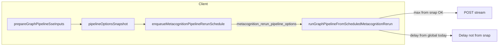

# Per-run metacognition rerun limits (all pipelines)

## Reconciliation with repo (recent state)

- **This feature is not implemented yet.** There are no `effectiveMaxMetacognitionReruns`, `metacognitionOverrides`, or `pipelineMetacognitionOverrides` symbols under [`src/`](f:\Alek\YourBrain\src); graph and one-shot paths still use [`resolveMaxMetacognitionReruns(runtimeSettings)`](f:\Alek\YourBrain\src\lib\runtimeSettings.js) / [`resolveMetacognitionRerunDelayMinutes`](f:\Alek\YourBrain\src\lib\runtimeSettings.js) only.
- **Confirmed gap (still accurate):** [`runGraphPipelineFromScheduledMetacognitionRerun`](f:\Alek\YourBrain\src\lib\runGraphPipelineOneShot.js) sets `delayMin` from **global** runtime only (e.g. around the line that assigns `resolveMetacognitionRerunDelayMinutes(runtimeSettings)` after loading `snap`), not from `metacognition_rerun_pipeline_options`. Max reruns for continuations still flow via `{ ...snap }` on `pipelineOptionsSnapshot`.
- **Global settings UI unchanged:** [`LocalMindPages.jsx`](f:\Alek\YourBrain\src\pages\LocalMindPages.jsx) already exposes **global** `maxMetacognitionReruns` and `metacognitionRerunDelayMinutes`. Per-run overrides are **additive** (optional fields that fall back to these globals).
- **ScheduledTask persistence:** [`EntityManager.create`](f:\Alek\YourBrain\src\services\localStorage.js) spreads arbitrary `data` into IndexedDB records, but [`scheduleTask`](f:\Alek\YourBrain\src\lib\schedulerStore.js) only forwards a **fixed** set of keys today. New per-task override fields must be added to `scheduleTask(..., options)` (and any direct `ScheduledTask.create` call sites) so they are actually stored; no separate migration layer is required beyond writing those properties.
- **Sanitizer:** [`sanitizeMetacognitionPipelineOptionsSnapshot`](f:\Alek\YourBrain\src\lib\scheduleMetacognitionPipelineRerun.js) only removes `deferMetacognitionRerun` and `pipelineMetacognitionContinuation`. Any **`metacognitionRerunDelayMinutes`** placed on the snapshot for round-trip should remain unless explicitly stripped (do not add it to the delete list).

**Orthogonal recent work (does not replace this plan):**

- Cooperative pause: per-token `localStorage` keys (`mybrain_coop_pt_v1_*`) in [`pipelineActiveRunRegistry.js`](f:\Alek\YourBrain\src\lib\pipelineActiveRunRegistry.js) fix multi-tab pause races.
- App icons: master at [`public/branding/app-icon-source.png`](f:\Alek\YourBrain\public\branding\app-icon-source.png), regenerate via `npm run generate:icons` ([`scripts/generate-apple-touch-icon.ps1`](f:\Alek\YourBrain\scripts\generate-apple-touch-icon.ps1)).

## Scope

Overrides apply to **every** pipeline flavor, not only the graph page:

| Surface | Entry | Mechanism |
|---------|--------|-----------|
| Graph | [`consciousnessStreamRunner.js`](f:\Alek\YourBrain\src\lib\consciousnessStreamRunner.js) | `graphPipelineStore` overrides passed into `prepareGraphPipelineSseInputs` |
| Curiosity / questions | [`curiosityPursuit.js`](f:\Alek\YourBrain\src\lib\curiosityPursuit.js) → `runGraphPipelineOneShot` | Per-pursuit (or per-run) overrides from curiosity UI store / pursuit row |
| Goals | [`goalPursuit.js`](f:\Alek\YourBrain\src\lib\goalPursuit.js) → `runGraphPipelineOneShot` | Same pattern as curiosity |
| Scheduled tasks | [`scheduledTaskRunner.js`](f:\Alek\YourBrain\src\lib\scheduledTaskRunner.js) (`runConsciousnessStreamScheduled`, `runGraphPipelineForScheduler`, etc.) | Optional fields on the `ScheduledTask` row passed through `scheduleTask` / `ScheduledTask.create`, read at run time and forwarded to `prepareGraphPipelineSseInputs` / `runGraphPipelineOneShot` |
| Deferred supervisor rerun | Already uses snapshot | Fix delay-from-snapshot + ensure snapshot carries overrides from originating run |

Scheduler UI: wherever tasks are created or edited (e.g. schedule curiosity/goal/graph runs), expose the same two optional fields when product-wise feasible; at minimum, stored overrides on the task must be honored when the runner executes.

## Current behavior

- **Max reruns**: [`server/pipeline.js`](f:\Alek\YourBrain\server\pipeline.js) uses `options.maxMetacognitionReruns` per POST (already supports per-request values).
- **Client** always builds `pipelineOptionsSnapshot` with globals from [`resolveMaxMetacognitionReruns`](f:\Alek\YourBrain\src\lib\runtimeSettings.js) / [`resolveMetacognitionRerunDelayMinutes`](f:\Alek\YourBrain\src\lib\runtimeSettings.js) in:
  - [`consciousnessStreamRunner.js`](f:\Alek\YourBrain\src\lib\consciousnessStreamRunner.js) (interactive graph)
  - [`prepareGraphPipelineSseInputs`](f:\Alek\YourBrain\src\lib\runGraphPipelineOneShot.js) (one-shots, scheduled consciousness)
- **Deferred reruns**: [`enqueueMetacognitionPipelineRerunSchedule`](f:\Alek\YourBrain\src\lib\scheduleMetacognitionPipelineRerun.js) persists `metacognition_rerun_pipeline_options` (sanitized snapshot). **`maxMetacognitionReruns` survives** and is used on continuation via `{ ...snap }` in [`runGraphPipelineFromScheduledMetacognitionRerun`](f:\Alek\YourBrain\src\lib\runGraphPipelineOneShot.js).
- **Gap**: Continuation legs **always** use global `delayMin` from runtime settings, ignoring any per-run choice from the original run. Per-run max/delay is not selectable per surface today.

## Design

1. **Effective-value helpers** in [`runtimeSettings.js`](f:\Alek\YourBrain\src\lib\runtimeSettings.js): e.g. `effectiveMaxMetacognitionReruns(runtimeSettings, override)` and `effectiveMetacognitionRerunDelayMinutes(runtimeSettings, override)` where `override` is `undefined` (use global) or a finite number. Reuse existing clamps (`0–20` for max, existing delay normalizer).

2. **Extend `prepareGraphPipelineSseInputs(opts)`** ([`runGraphPipelineOneShot.js`](f:\Alek\YourBrain\src\lib\runGraphPipelineOneShot.js)): accept optional `metacognitionOverrides: { maxMetacognitionReruns?, metacognitionRerunDelayMinutes? }`. Compute `delayMin` and `pipelineOptionsSnapshot.maxMetacognitionReruns` from helpers. Include **`metacognitionRerunDelayMinutes`** on the snapshot for client round-trip (server [`mergeMindRuntimeIntoSharedMemory`](f:\Alek\YourBrain\server\mindPolicy.js) does not copy arbitrary keys).

3. **Scheduled continuation**: In `runGraphPipelineFromScheduledMetacognitionRerun`, set `delayMin` from **snapshot first** (if `snap.metacognitionRerunDelayMinutes` is present and valid), else global.

4. **Graph (interactive)**: [`graphPipelineStore`](f:\Alek\YourBrain\src\lib\graphPipelineStore.js) fields `pipelineMetacognitionOverrides` with `null` = use global; persist in session KV. [`consciousnessStreamRunner.js`](f:\Alek\YourBrain\src\lib\consciousnessStreamRunner.js) passes overrides into `prepareGraphPipelineSseInputs`. UI on graph controls or [`GraphPipelineInspector.jsx`](f:\Alek\YourBrain\src\components\graphPipeline\GraphPipelineInspector.jsx).

5. **`runGraphPipelineOneShot`**: Optional `metacognitionOverrides` forwarded to `prepareGraphPipelineSseInputs` (used by graph one-shots, curiosity, goals, scheduler).

6. **Curiosity + goals**: Extend pursuit UI state (e.g. [`initialCuriosityPipelineUi`](f:\Alek\YourBrain\src\lib\curiosityPipelineSseUi.js) and goal pipeline UI parallel) with the same optional override fields; in [`curiosityPursuit.js`](f:\Alek\YourBrain\src\lib\curiosityPursuit.js) / [`goalPursuit.js`](f:\Alek\YourBrain\src\lib\goalPursuit.js), pass `metacognitionOverrides` into `runGraphPipelineOneShot` from the active pursuit’s stored values. Curiosity/Goals pages need small controls (or inspector) to edit overrides before “Pursue” / deep chain runs.

7. **Scheduled tasks**: Add optional persisted fields to the object passed through [`scheduleTask`](f:\Alek\YourBrain\src\lib\schedulerStore.js) (e.g. `metacognition_max_reruns_override`, `metacognition_rerun_delay_minutes_override`). Thread from task-creation UIs into:
   - `runConsciousnessStreamScheduled` → `prepareGraphPipelineSseInputs({ ..., metacognitionOverrides })`
   - `runGraphPipelineForScheduler` / other `runGraphPipelineOneShot` call sites in [`scheduledTaskRunner.js`](f:\Alek\YourBrain\src\lib\scheduledTaskRunner.js)
   Default when absent: current global runtime behavior.

8. **Sanity**: Grep all `prepareGraphPipelineSseInputs(` and `runGraphPipelineOneShot(` call sites; verify unchanged behavior when overrides are omitted.

## Files to touch (expanded)

| Area | Files |
|------|--------|
| Core | [`runtimeSettings.js`](f:\Alek\YourBrain\src\lib\runtimeSettings.js), [`runGraphPipelineOneShot.js`](f:\Alek\YourBrain\src\lib\runGraphPipelineOneShot.js) |
| Graph | [`consciousnessStreamRunner.js`](f:\Alek\YourBrain\src\lib\consciousnessStreamRunner.js), [`graphPipelineStore.js`](f:\Alek\YourBrain\src\lib\graphPipelineStore.js), graph UI components |
| Curiosity / goals | [`curiosityPipelineSseUi.js`](f:\Alek\YourBrain\src\lib\curiosityPipelineSseUi.js), [`goalPipelineSseUi.js`](f:\Alek\YourBrain\src\lib\goalPipelineSseUi.js) or goal store, [`curiosityPursuit.js`](f:\Alek\YourBrain\src\lib\curiosityPursuit.js), [`goalPursuit.js`](f:\Alek\YourBrain\src\lib\goalPursuit.js), relevant pages in [`LocalMindPages.jsx`](f:\Alek\YourBrain\src\pages\LocalMindPages.jsx) / [`GoalStackPage.jsx`](f:\Alek\YourBrain\src\pages\GoalStackPage.jsx) as needed |
| Scheduler | [`scheduledTaskRunner.js`](f:\Alek\YourBrain\src\lib\scheduledTaskRunner.js), [`schedulerStore.js`](f:\Alek\YourBrain\src\lib\schedulerStore.js), scheduler UI panels that create tasks |

No server pipeline logic change required for max reruns; optional snapshot field for delay is client-only.
