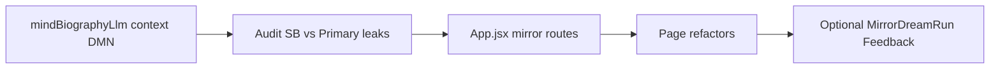

# System B — mirror UI + correct store routing

## Scope (confirmed)

1. **Mirror routes in [`App.jsx`](src/App.jsx)** — Register `/health/mirror`, `/mind-self/mirror`, `/dmn-reflections/mirror`, `/personality/mirror`, `/dreaming/mirror` (same components as primary). **`/output-search/mirror` is already present** — no duplicate work.
2. **Biography / context / DMN libs → [`getMindEntityStores()`](src/lib/mindEntityContext.js)** — Refactor [`mindBiographyLlm.js`](src/lib/mindBiographyLlm.js), [`mindBiographyContext.js`](src/lib/mindBiographyContext.js), [`mindDmnContext.js`](src/lib/mindDmnContext.js) so entity list/create/read paths follow the active mind profile, not static imports from [`./data`](src/lib/data.js).
3. **Page refactors** — [`useScopedEntities()`](src/context/MindScopeContext.jsx) + [`MindScopeTabs`](src/components/MindScopeTabs.jsx) on the pages above; **personality** mirror behavior (separate field/KV vs primary); **consolidation** on Self & consolidation: wrap [`runConsolidationPass`](src/lib/mindPersistence.js) with `setActiveMindEntityProfile` when on mirror; **MindBiography**: remove primary-only gate for mirror and align manual “Write New Version” with profile when needed.
4. **Optional decision** — **`MirrorDreamRun`** and optionally **`MirrorFeedbackItem`**: either keep minimal (Health/Dreaming show primary-only or empty for those metrics on mirror) or add mirror entity rows in [`localStorage.js`](src/services/localStorage.js) / [`data.js`](src/lib/data.js) / [`mindScopeEntities.js`](src/lib/mindScopeEntities.js) for full parity.

---

## Cross-cutting requirement: System B outputs → System B pages and stores only

**Goal:** After a **System B** graph run (mirror profile), persisted artifacts and any UI that reflects “that mind” must read/write **mirror** entity types — not Primary — so **all System B sidebar pages** stay consistent with pipeline output.

**Fix if they don’t:** Audit and patch any remaining leaks.

| Layer | What to verify |
|-------|------------------|
| **Pipeline persist** | [`persistMindAfterPipeline`](src/lib/mindPersistence.js) already uses `getMindEntityStores()`; keep that contract. |
| **Biography / DMN / context** | Static `./data` in biography + DMN libs is the known leak — addressed in scope item (2). |
| **merge / scheduled paths** | [`mergeBeliefsFromRecentPipelineRuns`](src/lib/mindPersistence.js) uses `E()` — runs under whatever profile is active at call time; ensure System B completion does not reset profile before merge (checkpoint ordering already helps). |
| **Pages on `/…/mirror`** | Every mind page listed in scope must use `useScopedEntities()` (or equivalent) so **displayed** data is mirror rows; no leftover `from '../lib/data'` for entity CRUD on those routes. |
| **DreamRun / Feedback** | If not added to mirror entities, document or UI-note that those two metrics stay primary-only until optional `MirrorDreamRun` / `MirrorFeedbackItem` land. |
| **Personality** | Mirror-specific runtime field/KV so edits on `/personality/mirror` don’t overwrite primary profile. |

**Explicit verification:** After System B Voice, **mirror** routes show new/updated content (biography, memory, beliefs, health counts, self/digest, DMN, output search, dreaming artifacts per decision); **primary** routes unchanged for that run.

---

## Already implemented (recent changes — do not repeat)

Checkpoint ordering + IndexedDB recovery landed; **orthogonal** to biography/DMN using `./data`.

| Area | What landed | Files |
|------|-------------|-------|
| Checkpoint vs final persist | `awaitIncrementalCheckpointChain()` then `setActiveMindEntityProfile(mindProfile)` before dialogue / `PipelineRun` / `persistMindAfterPipeline` | [`consciousnessStreamRunner.js`](src/lib/consciousnessStreamRunner.js) (incl. paused path) |
| One-shot persist | Same await at start of `persistGraphPipelineStreamResult` | [`runGraphPipelineOneShot.js`](src/lib/runGraphPipelineOneShot.js) |
| Export | `awaitIncrementalCheckpointChain` | [`incrementalModuleCheckpointPersist.js`](src/lib/incrementalModuleCheckpointPersist.js) |
| IDB recovery | `reconnectIndexedDbPreservingMemoryState`, retry on put/delete, KV flush retry + dirty restore | [`browserStorage.js`](src/lib/browserStorage.js) |

[`persistMindAfterPipeline`](src/lib/mindPersistence.js) already uses `getMindEntityStores()`. Wrong biography/LTM on primary is from **mindBiographyLlm / mindBiographyContext / mindDmnContext** still binding **primary** managers.

---

## Execution order (recommended)

1. **Libs** (biography, context, DMN) — fixes pipeline + manual biography when profile is set correctly.
2. **Audit** — grep for remaining entity access that ignores mirror (`from './data'` in pipeline-adjacent libs, pages still on static imports); fix so System B outputs only populate mirror-backed pages.
3. **Routes** — unblocks `/…/mirror` URLs and tab navigation.
4. **Pages** — scoped loads, tabs, personality + consolidation behavior.
5. **Optional** — `MirrorDreamRun` / `Feedback` after decision.

---

## Out of scope (unless explicitly added later)

- **Blind pathname → `setActiveMindEntityProfile` in `MindScopeProvider`** — can race in-flight System A pipeline; use explicit profile in actions + lib fixes instead.

---

## Verification

- New mirror paths render; Primary \| System B tabs work.
- After System B graph Voice: **mirror** pages (`/biography/mirror`, `/memory/mirror`, `/health/mirror`, `/mind-self/mirror`, `/dmn-reflections/mirror`, `/personality/mirror`, `/dreaming/mirror`, `/output-search/mirror`, etc.) reflect the run; **primary** stores unchanged for that run.
- Primary-only flows unchanged.
